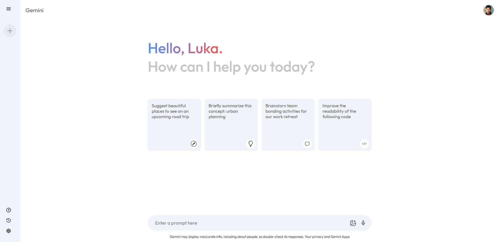

# Gemini AI Clone 🤖💬

This project is a **fully functional replica** of **Gemini AI**, built using **React**. It integrates **Gemini AI's API**, allowing users to interact with the chatbot seamlessly. 

## Features ✨
- **Real-time Chat**: Ask anything and get AI-generated responses instantly. 🧠⚡
- **Recent Chats**: View your previous conversations and continue where you left off. 📜
- **New Chat Functionality**: Start fresh conversations whenever needed. 🆕💬
- **Modern UI**: Clean, responsive, and user-friendly design. 🎨

## Installation & Usage 🚀
1. Clone the repository:
   ```sh
   git clone https://github.com/DevLukab/gemini-clone.git
   ```
2. Navigate to the project folder:
   ```sh
   cd gemini-ai-clone
   ```
3. Install dependencies:
   ```sh
   npm install
   ```
4. Add your Gemini AI API key in the `.env` file:
   ```sh
   REACT_APP_GEMINI_API_KEY=your_api_key_here
   ```
5. Start the development server:
   ```sh
   npm start
   ```

## Live Demo 🌐
Check out the live version here:
[Live Demo](https://devlukab.github.io/gemini-clone)

## Screenshots 📸


## Contact 📬
If you would like to contact me, you can reach me through:
- Email: [dev.lukab@gmail.com](mailto:dev.lukab@gmail.com)
- LinkedIn: [https://www.linkedin.com/in/luka-barbakadze-78b9352b8/](https://www.linkedin.com/in/luka-barbakadze-78b9352b8/)